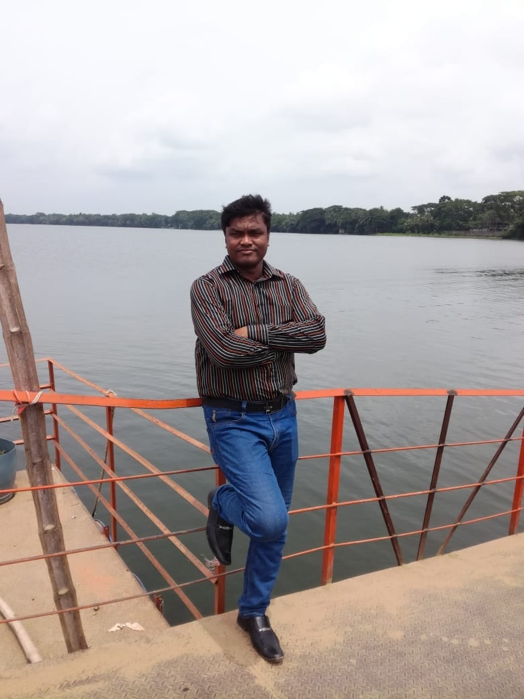

<!-- banner image starts here  -->

<!-- banner image ends here  -->

<h1> 👋 Hello, I'm Ruhul Amin </h1>

A full time content creator on & web developer  
🏠 &nbsp; Living: Khulna, Bangladesh

<!-- Contact me section starts here  -->

[][website]
[][youtube]
[][facebook]
[][linkedin]
 
 

<!-- Contact me section ends here  -->

<!-- about-me section starts here  -->

### 👨‍🏫 &nbsp; About Me

I am a passionate computer science teacher. I have been teaching programming languages, web development, and computer science-related subjects
to millions of Bangla speaking students worldwide through my YouTube channel for the last eight years. I had the opportunity
to teach thousands of Bachelor and Higher secondary students of different institutions in Bangladesh.
After completing my masters in Software, Web and Cloud in August 2004, I am spending much time
improving my web development skills. Every day I want to learn something new and share my knowledge with
my students and others.

 
<!-- about-me section ends here  -->

<!-- web related skills section starts here  -->

### 👨🏽‍💻 &nbsp; My Skills & Videos:

#### Key Skills & Videos on Web development:

[][htmlplaylist]
[][cssplaylist]
[][bootstrapplaylist]
[][javascriptplaylist]
[][jsonplaylist]
 
 
 

<!-- github stats starts here  -->

<!--  -->

 

<!-- latest youtube videos ends here -->

<!-- other skills and my videos for computer science section starts here  -->

<!-- work experience section starts here  -->

### 💼 &nbsp; Employment History

| Position            | Institute                                   | Duration            | Location           |
| ------------------- | ------------------------------------------- | ------------------- | ------------------ |
| Android developer   | M.H Soft                                    | Nov 2010 – Nov 2017 | Khulna, Bangladesh |
| CEO & Founder       | W3 Soft Limited                             | Nov 2017 – running  | Khulna, Bangladesh |

 

### Languages:

- 🇧🇩 Bangla : Native
- 🏴󠁧󠁢󠁥󠁮󠁧󠁿 English : Advanced
- 🇮🇳 Hindi : Intermediate
- 🇧🇷 Portugues : Basic
   

<!-- Links section starts here -->

[website]: http://www.w3soft.com.bd/
[youtube]: https://www.youtube.com/ruhulacademy
[facebook]: https://www.facebook.com/ruhulamin2s/
[linkedin]: https://www.linkedin.com/in/ruhulamin2s/
[github]: https://github.com/ruhulamin2s/

<!-- Links section ends here -->
